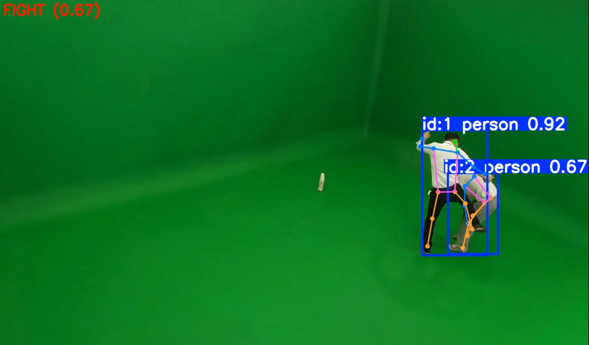

# PoseAttentionLSTM
Yolo pose based violence detection attentionLSTM  

## Process
Yolo v8x - pose  
Extract joint information  
Create joint group features  
Feed into attentionLSTM  
Determine if violence is present  

## Violence Detect

## Model
x ∈ (B, T, J, D)  
B: Batch size  
T: Time steps  
J: Number of Joint  
D: Joint feature  
&nbsp;  

[Input Pose Sequence: x]  
 └── shape: (B, T, J, D)  
&nbsp;&nbsp;&nbsp;&nbsp;↓  
[Spatial Attention ]    
 └── weight: w ∈ (J,) → softmax → attention ∈ (J,)  
 └── cal: x_attn = x * attention[None, None, :, None]  
 └── sum: x_reduced = x_attn.sum(dim=2)  
 └── result shape: (B, T, D)  
&nbsp;&nbsp;&nbsp;&nbsp;↓  
[LSTM input]  
 └── lstm_out, _ = LSTM(x_reduced)  
 └── lstm_out shape: (B, T, H)  
&nbsp;&nbsp;&nbsp;&nbsp;↓  
[Time Aggregation]  
 └── final_feat = lstm_out[:, -1, :]  
 └── shape: (B, H)  
&nbsp;&nbsp;&nbsp;&nbsp;↓  
[Classifier (MLP)]  
 └── Linear(H → 64) → ReLU → Linear(64 → 1) → Sigmoid  
 └── output: pred ∈ (B,)  ← each samples violence probability

 ### Refer
 https://github.com/erwinyo/Fight-Detection-Yolov8-Pose  
 https://github.com/song248/Violence-Detect-YOLO/tree/main?tab=readme-ov-file